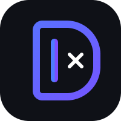

# DevMate AI

<p align="center">
  
</p>

<p align="center">
  An AI-powered developer companion for writing, understanding, debugging, and documenting code.
</p>

DevMate AI helps developers turn coding questions into practical answers and project progress. It combines Gemini AI with a focused set of developer tools, Firebase-backed accounts and history, responsive layouts, and English and Arabic localization.

## Features

- **AI Chat** for open-ended programming help and pair-programming conversations.
- **Code Review** to analyze code for quality and best practices.
- **Debug Code** to identify errors and suggest fixes.
- **Explain Code** to break down complex logic into understandable steps.
- **Generate README** to create project documentation from a description and optional GitHub link.
- **Project Planner** to turn an idea into a structured development plan.
- **Conversation history** backed by Cloud Firestore.
- **Authentication** with email/password, Google, GitHub, guest access, email verification, and password reset flows.
- **Light and dark themes** with responsive mobile, tablet, and desktop layouts.
- **English and Arabic** language support.
- **Markdown and syntax-highlighted code** in AI responses.

## Built With

- [Flutter](https://flutter.dev/) and Dart
- [Firebase Core](https://firebase.google.com/docs/flutter/setup), Firebase Authentication, and Cloud Firestore
- [Google Gemini API](https://ai.google.dev/) through `google_generative_ai`
- [flutter_bloc](https://pub.dev/packages/flutter_bloc) for state management
- [go_router](https://pub.dev/packages/go_router) for navigation
- `flutter_markdown_plus`, `flutter_highlight`, and related packages for formatted code responses
- `get_it` for dependency injection

## Prerequisites

- Flutter SDK compatible with Dart `^3.11.0`
- Android Studio and/or Xcode for mobile development
- A Firebase project configured for the platforms you want to run
- A Gemini API key

Check the local installation before starting:

```bash
flutter doctor
```

## Getting Started

1. Clone the repository and enter the project directory.

	```bash
	git clone <your-repository-url>
	cd dev_mate_ai
	```

2. Install Flutter dependencies.

	```bash
	flutter pub get
	```

3. Create a `.env` file in the project root:

	```dotenv
	GEMINI_API_KEY=your_gemini_api_key
	```

4. Configure Firebase for your development platforms. The app initializes Firebase from `lib/firebase_options.dart`, so make sure that file and the native Firebase configuration files are present for your environment. Enable the authentication providers used by the app and create a Cloud Firestore database.

5. Run the application:

	```bash
	flutter run
	```

The `.env` file and Firebase configuration files are ignored by Git. Never commit API keys or private Firebase credentials to the repository.

## Useful Commands

```bash
# List available devices
flutter devices

# Run static analysis
flutter analyze

# Run tests
flutter test

# Format Dart files
dart format lib test

# Build an Android release
flutter build apk --release
```

## Project Structure

```text
lib/
├── core/                 Shared services, routing, theme, DI, widgets, and utilities
├── features/
│   ├── auth/             Authentication and account flows
│   ├── chat_screen/      Gemini chat and persisted conversations
│   ├── code_review/      Code review workflow
│   ├── debug_code/       Debugging workflow
│   ├── explain_code/     Code explanation workflow
│   ├── generate_readme/  README generation workflow
│   ├── history/          Conversation history
│   ├── home/             Home dashboard and quick tools
│   ├── onboarding/       First-run onboarding
│   ├── profile/          Profile and account settings
│   └── project_planner/  Project planning workflow
├── generated/            Generated localization code
├── l10n/                 English and Arabic localization resources
└── main.dart             Application entry point
```

The feature modules follow a layered structure with presentation, domain, and data responsibilities where applicable. Shared dependencies are registered through the service locator in `lib/core/di`.

## Localization

The source translation files are in `lib/l10n/`:

- `intl_en.arb` for English
- `intl_ar.arb` for Arabic

Generated localization files live in `lib/generated/`. After changing ARB files, regenerate localization output with:

```bash
flutter gen-l10n
```

## Testing

The project includes Flutter widget tests and Firebase chat data-source tests. Run the complete test suite with:

```bash
flutter test
```

## Security Notes

- Keep `GEMINI_API_KEY` in `.env` and out of source control.
- Treat Firebase client configuration as environment-specific configuration.
- Configure Firebase Authentication and Firestore security rules before using the app with real user data.

## License

No license has been specified for this repository yet.
